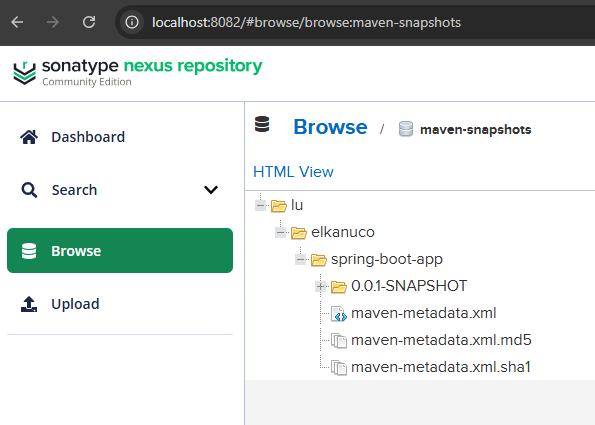

# No docker No problem. The bare minimum is bare metal

> [!WARNING]  
> Yes I will use Docker to setup the test environment</br>
> But you should have your own VM(s) with your own network setup and be able to understand and emulate more or less the same procedure

## What is this about?

This setup showcases a more or less complete CI/CD lifecycle strategy to deploy and manage an application.

## Why is this important?

Not everyone uses Docker (or any other Open Container Initiative engine), although it's a tech that was released back in 2013 and is the de facto standard to build and share containerized apps recognised by millions of developers. </br>
More work more fun ? In fact working with VM's instantiated from on premises bare metal is not available to everyone neither, so to have this is also a huge benefit and also allows us to confront real fun use case scenarios like security, networking and stuff ^^ </br>

## How does this work?

I am happy I had that experience a few years back at P&T Consulting.</br>
A Luxembourg-based information and communications technology consulting firm specializing in digital solutions. It was majority-owned by POST Luxembourg. I think it no longer exists as it was completely absorbed by POST.</br>
With their e-services platform they had a much more complex setup but entirely based on this deployment strategy.</br>
Shout-out, kudos to Mariusz P. & Emmanuel B. !!! </br>
Sharing is caring and always remember to give credit where credit is due ^^

So... you should know that there are multiple choices when it comes to VM's OS : Ubuntu, CentOS, etc. </br>
If we stick the aforementioned we have .deb (Debian packages) vs .rpm (Red Hat Package Manager). APT (Advanced Package Tool) vs YUM (Yellowdog Updater, Modified). </br>
Both Linux distributions have an init system and service manager, systemd responsible for bootstrapping the user space, starting services, and managing processes after the kernel has loaded.</br>

In my showcase I chose CentOS so I will be using yum and rpm.</br>

As you know Maven is the de facto standard to build java applications. Maven has plugins that can be used to package an application as an [RPM package](https://www.mojohaus.org/rpm-maven-plugin/). This is something released before 2010 btw ^^. But this strategy came even before that I guess ^^ </br>

The RPM package can package a systemd definition along with the deliverables.</br>
Nexus can also be configured to store RPM packages.</br>
Nexus can be registed in your CentoOS VM as a RPM repo </br>
And just like that we reach full cycle with a minimum viable solution.

1. We build a java app exposing a REST API and its swagguer ui
2. We publish the code in GitLab (where we can define our CI/CD workflow that can automate a few steps)
3. We build and publish the deliverables on Nexus
4. We deploy and manage the application in our VM as a service
5. We override configuration with global environment variables and start the magic

### What happens if we implement this?

Deploying an application as a systemd service brings several practical advantages in production environments. It’s not just about starting your app at boot, systemd gives you a full lifecycle manager with monitoring, logging, and recovery built in.

1. Automatic startup and shutdown
2. Process supervision & recovery
3. Dependency management
4. Resource control
5. Unified logging
6. Security hardening
7. Consistency across environments
8. Timers and scheduling
9. etc

This is basically done through the definition of service unit files

```bash
[Unit]
Description=My Spring Boot Application
After=network.target

[Service]
User=appuser
ExecStart=/opt/myapp/bin/start.sh
Restart=always
Environment=SPRING_PROFILES_ACTIVE=prod

[Install]
WantedBy=multi-user.target

```

## Requirements for actual scenario

- Gitlab <https://docs.gitlab.com/install/>
- Nexus <https://help.sonatype.com/en/install-nexus-repository.html>
- CENTOS VM (the actual stack JDK 17, Maven, Git, etc are installed during the process)

## Requirements for simulated scenario

- Docker

## Useful to know

- <http://localhost:8880/users/sign_in>
- <http://localhost:8082/#browse/browse:rpm-releases>
- ``docker container exec -it centos-container /bin/bash`` -> root
- ``docker container exec -u springboot -it centos-container /bin/bash``
- <http://localhost:8888/swagger-ui/index.html#/operations-controller/process>

## TODO

- add CI/CD workflow
- check Nexus deployment strategy to deal with snapshop and release version
- check release tag process
- check alternatices to deal with the recreation of the rpm repo (download existing rpm packages and recreate metadata)
  - is it necessary? does entreprise edition have rpm repo ? does it need to be manually updated?
- add additional prefix to the rpm package ? is it necessary?
- prevent delete, update of existing rpm packages
- check how to pass environment variables
  - Remove Environment lines use centralized environment variables in /etc/environment or /etc/default/spring-boot-app as systemd reads them automatically

``` bash
sudo tee /etc/default/spring-boot-app <<EOF
JAVA_HOME=/opt/java
DB_PASSWORD=password
SPRING_DATASOURCE_URL=jdbc:postgresql://postgres:5432/yourdb
SPRING_DATASOURCE_USERNAME=youruser
EOF
```

## Useful

- check man page to see how to downgrade, upgrade, remove and install <https://man7.org/linux/man-pages/man8/yum.8.html>
- check man page to see how to start, stop, check <https://man7.org/linux/man-pages/man1/systemctl.1.html>
- check man page to see how to inspect <https://man7.org/linux/man-pages/man1/journalctl.1.html>

### Configure application

- choose global environment variables
- or edit ``vi /opt/spring-boot-app/config/application.properties``

### Start service

- ``systemctl start spring-boot-app``
- ``systemctl status spring-boot-app``
- ``systemctl daemon-reload``
- ``systemctl restart spring-boot-app``

### Check logs

- ``journalctl -u spring-boot-app -f``
- ``journalctl SYSLOG_IDENTIFIER=spring-boot-app -f``
- ``journalctl -u spring-boot-app --lines=100``
- ``journalctl -u spring-boot-app -f --no-pager``

### Tips

- ``systemctl edit spring-boot-app`` creates override ``/etc/systemd/system/spring-boot-app.service.d/override.conf``
- ``systemctl cat spring-boot-app``
- ``systemctl show spring-boot-app -p ExecStart``
- ``systemctl edit spring-boot-app.service --full``

The deliverables should look something like that


