# No docker No problem. The bare minimum is bare metal

> [!WARNING]  
> Yes I will use Docker to setup the test environment</br>
> But you should have your own VM(s) with your own network setup and be able to understand and emulate more or less the same procedure

## What is this about?

This setup showcases a more or less complete CI/CD lifecycle strategy to deploy and manage an application.

## Why is this important?

Not everyone uses Docker (or any other Open Container Initiative engine), although it's a tech that was released back in 2013 and is the de facto standard to build and share containerized apps recognised by millions of developers. </br>
More work more fun ? In fact working with VM's instantiated from on premises bare metal is not available to everyone neither, so to have this is also a huge benefit and also allows us to confront real fun use case scenarios like security, networking and stuff ^^ </br>

## How does this work?

Back in 2011 I worked at P&T Consulting. A Luxembourg-based information and communications technology consulting firm specializing in digital solutions. It was partially owned by POST Luxembourg. Today I think it no longer exists as it was completely absorbed by POST.</br>

With their e-services platform they had a much more complex setup:

- a SOA (Service Oriented Architecture)
  - with a clear separation between backend services, common services and front-end services
  - communicating through RPC (Remote Procedure Calls)
- with a blue/green styled deployment ensuring
  - zero downtime switching between two idential stages with the load balancer/reverse proxy
  - instant rollbacks with daily backups
- using RPM packages
  - to move the deliverables into the application servers (JBoss and Tomcat) deployment folder
  - to do version management

So, coming back to the topic at hand, you should know that there are multiple choices when it comes to VM's OS : Ubuntu, CentOS, etc. </br>
If we stick the aforementioned we have .deb (Debian packages) vs .rpm (Red Hat Package Manager). APT (Advanced Package Tool) vs YUM (Yellowdog Updater, Modified). </br>
Both Linux distributions have an init system and service manager, systemd responsible for bootstrapping the user space, starting services, and managing processes after the kernel has loaded.</br>

In my showcase I chose CentOS so I will be using yum and rpm.</br>
I added an ubuntu container and I also created a debian package. But the maven plugin is not an "official" maven plugin, I used org.vafer/jdeb</br>
The showcase will however focus on only using the RPM strategy.</br>

As you know Maven is the de facto standard to build java applications. Maven has plugins that can be used to package an application as an [RPM package](https://www.mojohaus.org/rpm-maven-plugin/). This is something released before 2010 btw ^^. But this strategy came even before that I guess ^^ </br>

The RPM package can package a systemd definition along with the deliverables.</br>
Nexus can also be configured to store RPM packages.</br>
Nexus can be registed in your CentoOS VM as a RPM repo </br>
And just like that we reach full cycle with a minimum viable solution.

1. We build a java app exposing a REST API and its swagguer ui
2. We publish the code in GitLab
3. We have a basic CI/CD build (with a workaround over the issue of working with a non Enterprise edition of Nexus)
   1. on push of PRs there's a basic build
   2. on push on develop there's a basic build + a release that creates a tag
   3. on creating a tag there's the build that publishes the RPM package on Nexus
4. We build and publish the deliverables on Nexus
5. We deploy and manage the application in our VM as a service
6. We override configuration with global environment variables and start the magic

### What happens if we implement this?

Deploying an application as a systemd service brings several practical advantages in production environments.</br>
It’s not just about starting your app at boot, systemd gives you a full lifecycle manager with monitoring, logging, and recovery built in.</br>

1. Automatic startup and shutdown
2. Process supervision & recovery
3. Dependency management
4. Resource control
5. Unified logging
6. Security hardening
7. Consistency across environments
8. Timers and scheduling
9. etc

The definition of service unit files looks something like this:

```bash
[Unit]
Description=My Spring Boot Application
After=network.target

[Service]
User=appuser
Group=myappgroup
WorkingDirectory=/opt/myapp
ExecStart=/opt/myapp/bin/start.sh
Environment=SPRING_PROFILES_ACTIVE=prod

# Enable accounting (often automatic, but explicit is safe)
MemoryAccounting=yes
CPUAccounting=yes

# Memory limits
MemoryLow=1G          # Protected memory: kernel tries to keep this available
MemoryHigh=2G         # Soft limit: above this, memory allocation is heavily throttled
MemoryMax=3G          # Hard limit: maximum memory (RAM + swap) the service can use

# CPU limits
CPUQuota=200%         # Hard cap: maximum 200% CPU (equivalent to 2 full cores)
CPUWeight=100         # Relative priority (default); lower = less CPU when competing

Restart=on-failure    # Restart=always
RestartSec=10

[Install]
WantedBy=multi-user.target

```

## Requirements for actual scenario

- Gitlab <https://docs.gitlab.com/install/>
- Nexus <https://help.sonatype.com/en/install-nexus-repository.html>
- CENTOS VM (the actual stack JDK 17, Maven, Git, etc are installed during the process)

## Requirements for simulated scenario

- Docker

## HOW TO TEST IT OUT

1. Run ``setup.sh``

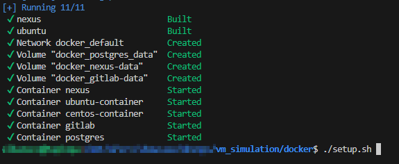

2. Get admin password from Gitlab ``docker exec -it gitlab cat /etc/gitlab/initial_root_password``

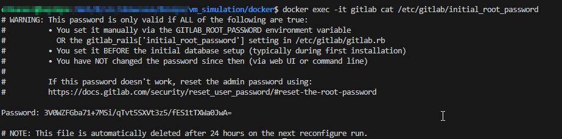

3. Update ``settings.xml`` and keep credenials at hand
4. Login as root <http://localhost:8880/users/sign_in>

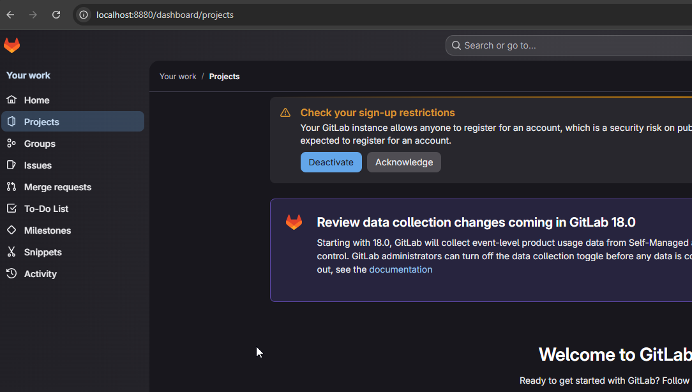

5. Setup Runner

```bash
#docker inspect gitlab-runner | grep -A 10 Networks
docker exec -it gitlab-runner bash

gitlab-runner register \
  --non-interactive \
  --url "http://gitlab:80" \
  --registration-token "GR1348941gXrEGUG4z2C4zBwd-zBY" \
  --executor "docker" \
  --docker-image "alpine:latest" \
  --description "docker-runner" \
  --docker-network-mode "docker_default" \
  --run-untagged="true" \
  --locked="false"
```

6. Access CentOS as root and execute ``00-setup-centos.sh``. JDK and Maven URLs might have to be updated!

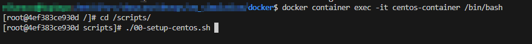
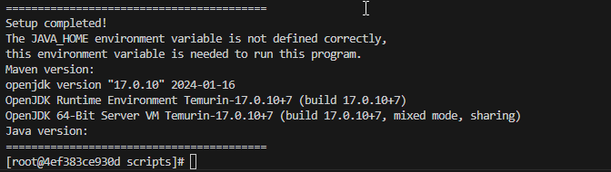

7. Push project onto Gitlab

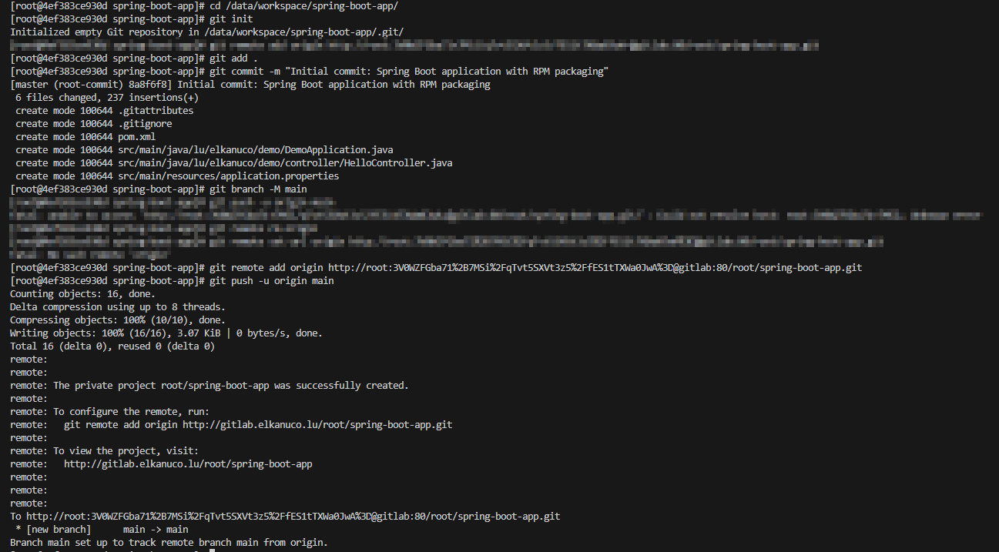
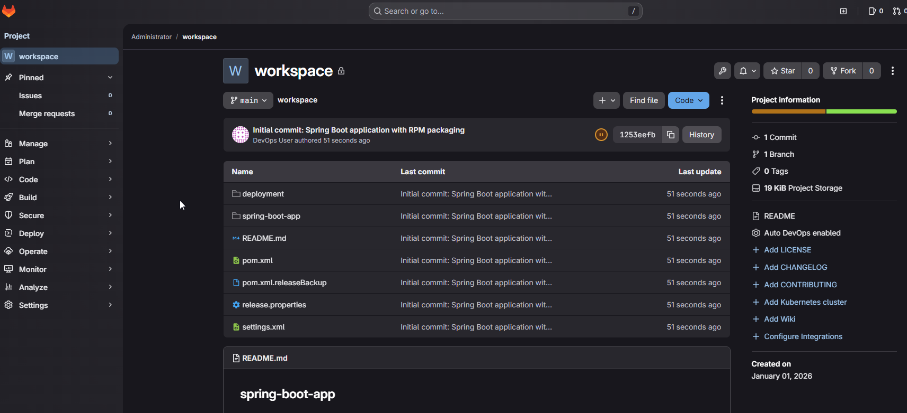

8. (SKIP if using CI/CD) Build

```bash
cd /data/workspace
mvn clean install -s ../workspace/settings.xml
```

9. Login and check Nexus ``admin/secret`` <http://localhost:8082/#browse/browse:maven-public>
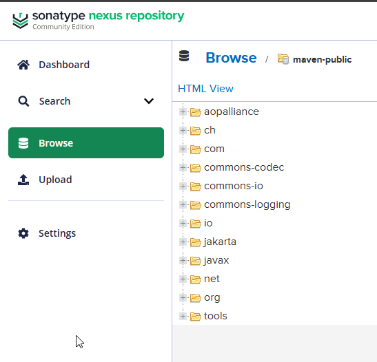

10. (SKIP if using CI/CD) Package RPM

```bash
cd /data/workspace/deployment
mvn clean package -Prpm -s ../settings.xml
```

11. Create ``rpm-releases`` repo and ``deployment/deployment123`` user

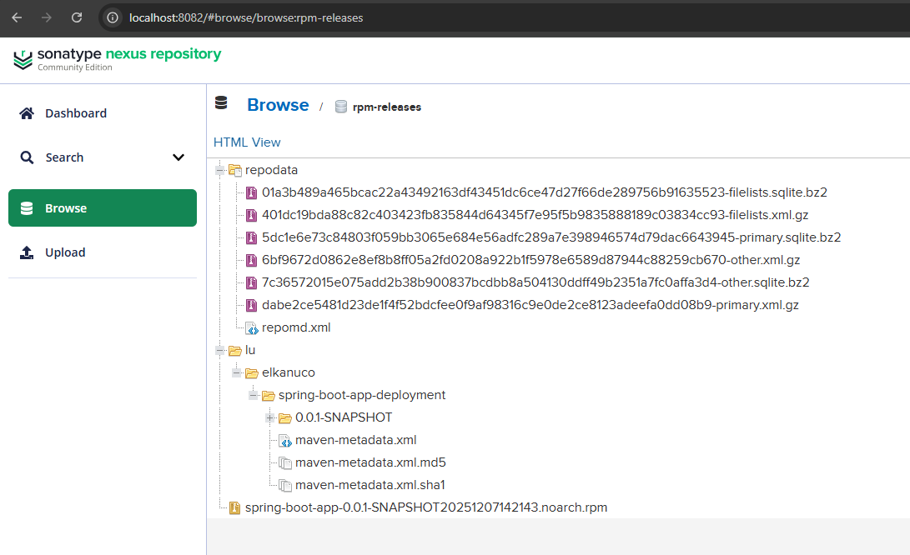
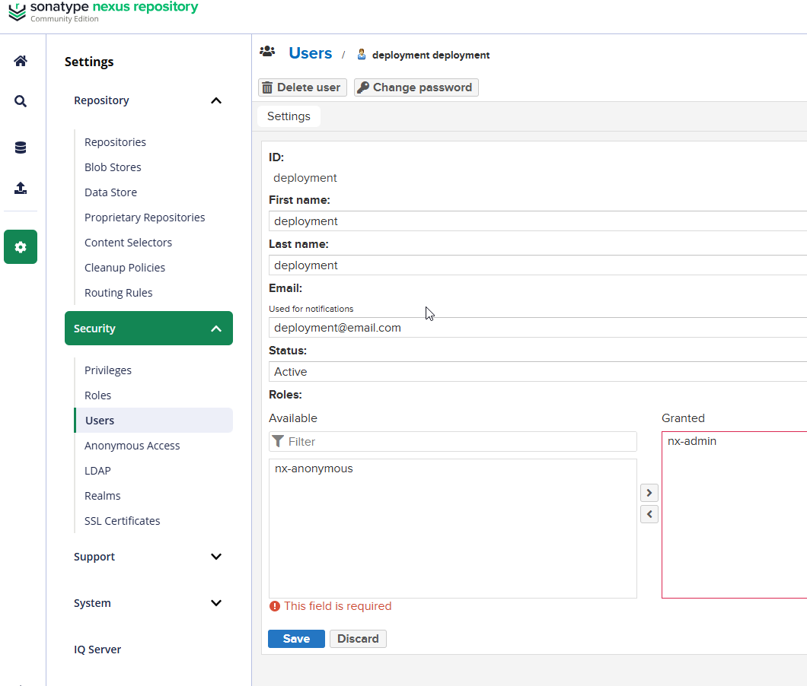

12. (SKIP if using CI/CD)Do a release (creating tag, publishing to Nexus, updating maven version) and create the rpm package

```bash
cd /data/workspace
mvn release:clean release:prepare release:perform -DreleaseVersion=1.0.0 -DdevelopmentVersion=2.0.0-SNAPSHOT -Dtag=v1.0.0 -s settings.xml
cd /data/workspace/deployment
mvn clean install -Dapp.jar.version=1.0.0 -Prpm -s ../settings.xml 
```

13. (SKIP if using CI/CD)Prepare and upload to Nexus (when using entreprise version the api should be better)

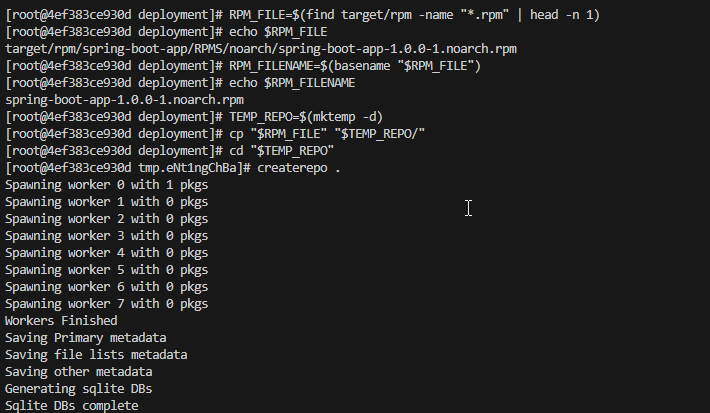
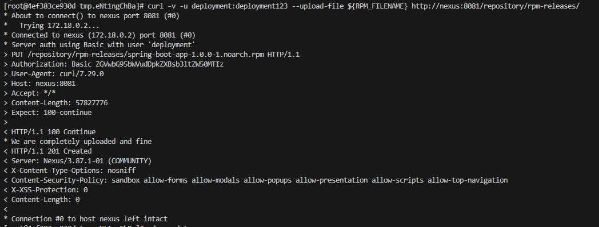
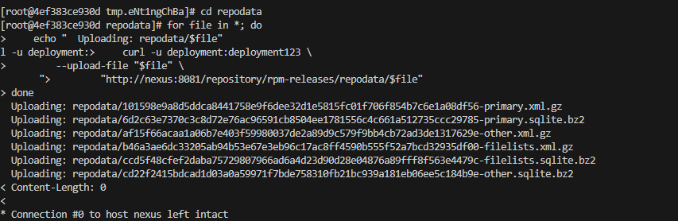
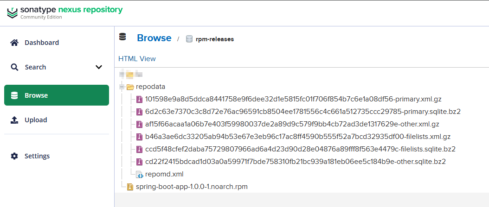

14. Configure YUM and install package

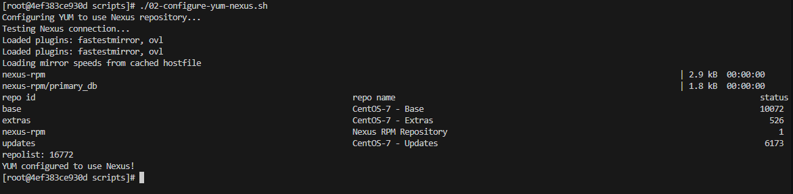

```bash
yum clean all && yum makecache && yum list available spring-boot-app --showduplicates
#set environment variable
tee /etc/default/spring-boot-app <<EOF
DB_PASSWORD=password
EOF
yum install -y spring-boot-app
```

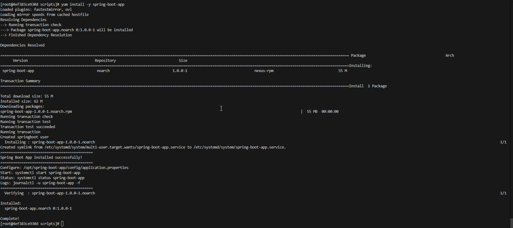
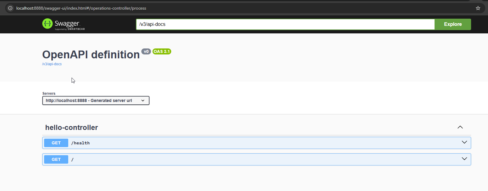

## Useful to know

- Access GitLab : <http://localhost:8880/users/sign_in>
- Access Nexus: <http://localhost:8082/#browse/browse:rpm-releases>
- Access CentOS as root : ``docker container exec -it centos-container /bin/bash``
- Access CentOS as user created for spring boot app : ``docker container exec -u springboot -it centos-container /bin/bash``
- Access Spring Boot Swagger UI: <http://localhost:8888/swagger-ui/index.html#/operations-controller/process>
- Encode URL (necessary when setting origin url): <https://www.urlencoder.org/>

- Access Ubuntu as root ``docker container exec -it ubuntu-container /bin/bash``
- Access Ubuntu as user created for spring boot app : ``docker container exec -u springboot -it ubuntu-container /bin/bash``

## TODO

- check alternatives to deal with the recreation of the rpm repo (download existing rpm packages and recreate metadata)
  - is it necessary? does entreprise edition have rpm repo ? does it need to be manually updated?
  - how to delete the repo folder
- prevent delete, update of existing rpm packages
- add hooks to the repo to secure branches and workflow
- check how to pass environment variables
  - use Vault or GitLab secrets management
- when a new version is installed we need to call the start
- check how the logs are managed
  - i added a spring.log file but it should be managed by the journalctl
- stress test ? 

## Useful

- check man page to see how to downgrade, upgrade, remove and install <https://man7.org/linux/man-pages/man8/yum.8.html>
- check man page to see how to start, stop, check <https://man7.org/linux/man-pages/man1/systemctl.1.html>
- check man page to see how to inspect <https://man7.org/linux/man-pages/man1/journalctl.1.html>

### Configure application

- choose global environment variables
- or edit ``vi /opt/spring-boot-app/config/application.properties``
- or edit ``vi tmp/etc/systemd/system/spring-boot-app.service``

### Troubleshooting

- ``su - springboot -s /bin/bash -c 'cd /opt/spring-boot-app && exec /usr/bin/java -jar spring-boot-app-1.0.0.jar --spring.config.location=file:/opt/spring-boot-app/config/application.properties'``
- ``ls -rtlah /opt/spring-boot-app/config/application.properties``
- ``su - springboot -s /bin/bash -c 'ls -rtlah /opt/spring-boot-app/config '``

### Manage service

- ``systemctl start spring-boot-app``
- ``systemctl status spring-boot-app``
- ``systemctl daemon-reload``
- ``systemctl restart spring-boot-app``
- ``systemd-cgtop``
- ``id springboot``
- ``systemctl daemon-reload && systemctl restart spring-boot-app && journalctl -u spring-boot-app -f -n 100``

### Check logs

- ``journalctl -u spring-boot-app -f``
- ``journalctl SYSLOG_IDENTIFIER=spring-boot-app -f``
- ``journalctl -u spring-boot-app --lines=100``
- ``journalctl -u spring-boot-app -f --no-pager``

### Extra

- ``systemctl edit spring-boot-app --full`` creates override ``/etc/systemd/system/spring-boot-app.service.d/override.conf``
- ``systemctl cat spring-boot-app``
- ``systemctl show spring-boot-app -p ExecStart``
- ``systemctl edit spring-boot-app.service --full``

### Key features of this strategy

Intuitive Start, Stop, Restart, and Status Commands: Systemd allows you to manage the Java application using standardized, user-friendly commands like ``systemctl start app-name``, ``systemctl stop app-name``, ``systemctl restart app-name``, and ``systemctl status app-name``. This eliminates the need for custom scripts or manual process killing, providing a consistent interface across all services on the system. It streamlines operations for developers and sysadmins, reducing errors and improving efficiency in deployment and maintenance.</br>

Customization and Fine-Tuned Configuration: The systemd service file offers extensive options for tailoring the application's behavior, such as specifying working directories, timeouts, or exec paths. This level of control is referenced in systemd's man pages and allows for precise adjustments without modifying the Java code itself.</br>

Automatic Handling of PID Files and Console Logs: Systemd manages process ID (PID) files and console output automatically, freeing you from implementing these in your Java app or wrapper scripts. This simplifies setup and ensures reliable tracking of the application's state.</br>

Automatic Restart on Failure: If the Java application crashes or exits unexpectedly, systemd can be configured (e.g., via ``Restart=on-failure`` and ``RestartSec=10s``) to automatically restart it after a delay. This enhances uptime and resilience, especially for long-running services like web servers or background workers, without requiring external monitoring tools.</br>

Graceful Shutdown Support: Systemd handles shutdown signals properly, such as sending ``SIGTERM`` (via ``ExecStop=/bin/kill -15 $MAINPID``) to allow the Java app to clean up resources before exiting. It also recognizes common exit statuses (e.g., 143 for ``SIGTERM``), ensuring smooth stops and restarts during maintenance or system reboots.</br>

Dependency Management: You can declare dependencies in the service file (e.g., ``After=network.target`` or ``After=syslog.target``), ensuring the Java app starts only after required services like networking or databases are available. This prevents startup failures due to unmet prerequisites and improves overall system stability.</br>

Automatic Startup on System Boot: Enabling the service with ``systemctl enable app-name`` ensures the Java application launches automatically during boot, without manual intervention. This is ideal for server environments where applications need to be always-on, integrating seamlessly into the boot process.</br>

Environment Variable Configuration: Systemd allows setting environment variables directly in the service file (e.g., ``Environment="JAVA_HOME=/path/to/java" "JAVA_OPTS=-Xmx512m"``), ensuring the Java runtime and app-specific settings are consistently applied. This avoids reliance on global profiles or wrapper scripts, making deployments reproducible.</br>

Modern Compatibility with Linux Distributions: As the successor to SysV init, systemd is standard on most contemporary Linux distros, providing a future-proof deployment method. It supports structured service scripts for Java apps, making it easier to maintain consistency across environments like AWS, bare metal, or containers.</br>

Run as a Designated or Dynamic User: The service can run under a specific non-root user and group (e.g., ``User=myapp, Group=myapp``), isolating it from other processes and reducing risks if compromised. Dynamic users (``DynamicUser=yes``) allocate temporary UIDs that aren't persisted, ideal for stateless apps and minimizing filesystem impact.</br>

Privilege Minimization and Setup: Systemd handles high-privilege setup tasks (e.g., creating namespaces) before dropping to the service's user, avoiding the need for the Java app to start as root. This reduces exposure to vulnerabilities in the app's startup code.</br>

Filesystem and Mount Namespace Protections: Features like ProtectSystem=full make system directories (e.g., ``/usr``, ``/etc``) read-only, ``ProtectHome=yes`` restricts access to user homes, and ``PrivateTmp=yes`` provides isolated temporary directories. This prevents the app from accessing or modifying unauthorized files, adding defense-in-depth.</br>

Fine-Grained Path Access Control: Directives such as ``ReadOnlyPaths=``, ``ReadWritePaths=``, and ``InaccessiblePaths=`` allow precise control over filesystem access, binding mounts for specific directories while restricting others. This is particularly useful for Java apps handling sensitive data.</br>

Centralized and Language-Independent Security: Security hardening is applied uniformly regardless of the app's language, with abstractions for kernels and architectures (e.g., SELinux on RHEL or AppArmor on Ubuntu). This well-tested, centralized approach simplifies securing Java apps compared to custom implementations.</br>

Automatic Directory Management with Ownership: Systemd creates and owns directories for configs (``ConfigurationDirectory=``), caches (``CacheDirectory=``), states (``StateDirectory=``), logs (``LogsDirectory=``), and runtime (``RuntimeDirectory=``), tying them to the service user. Ephemeral directories are cleaned up on stop, reducing security risks from leftover files.</br>

Integrated Logging with journalctl: All output from the Java app is captured in systemd's journal, accessible via ``journalctl -u app-name``. This provides structured, searchable logs with timestamps, priorities, and metadata, simplifying debugging, auditing, and integration with tools like ELK Stack.</br>

Resource Limiting via Cgroups: Although not explicitly detailed in the sources, systemd integrates with Linux cgroups to set limits like ``CPUQuota=``, ``MemoryMax=``, or ``IOWeight=``, preventing the Java app from consuming excessive resources and improving system stability in multi-tenant environments. This is a native feature that enhances performance isolation. These limits protect the system from rogue or leaky Java apps (e.g., memory leaks causing unbounded heap growth). For production, tune values based on testing, and consider adding ``OOMScoreAdjust=500`` to make the service more likely to be killed system-wide if needed. Always test in a staging environment!</br>

#### Memory Limits (using cgroups v2, standard on modern Linux)

``MemoryLow=1G:`` This is a "protection" threshold. The kernel prioritizes keeping at least 1G available for this service. If system-wide memory pressure occurs, other services may be reclaimed first to protect this one.</br>
``MemoryHigh=2G`` (soft limit). When exceeded, the kernel heavily throttles new memory allocations for processes in the service.
The Java app may experience significant slowdowns (e.g., GC pauses longer, allocations fail temporarily or become very slow).
The kernel attempts to reclaim memory (e.g., drop caches, page out unused pages).
The service continues running but performs poorly until usage drops below the limit.

``MemoryMax=3G`` (hard limit). When exceeded and memory cannot be reclaimed to stay under the limit, the OOM (Out-of-Memory) killer is invoked within the cgroup. It selects and kills one or more processes in the service (often the one using the most memory, like the JVM). The main Java process typically dies with a signal (e.g., SIGKILL). If Restart=on-failure is set (as in the example), systemd automatically restarts the service shortly after. Logs will show OOM events in dmesg or journalctl (e.g., "Out of memory: Kill process ... (java)").

#### CPU Limits

``CPUWeight=100:`` This is relative scheduling priority. If multiple services compete for CPU, lower-weight ones get less time. No hard enforcement if CPU is idle.</br>
``CPUQuota=200%`` (hard limit). The service's total CPU usage is capped at 200% (2 full cores equivalent), measured over a default period of ~100ms. When exceeded, processes are throttled: they are paused and not scheduled until the next period.  The app slows down proportionally (e.g., runs at most at 200% capacity, even if more cores are idle). No killing occurs; it just enforces the cap, preventing the Java app from hogging the entire system.
